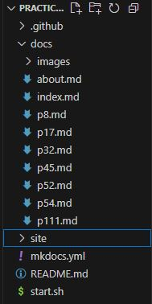
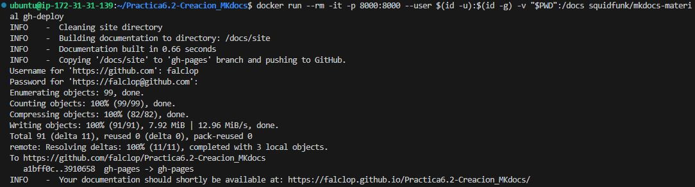
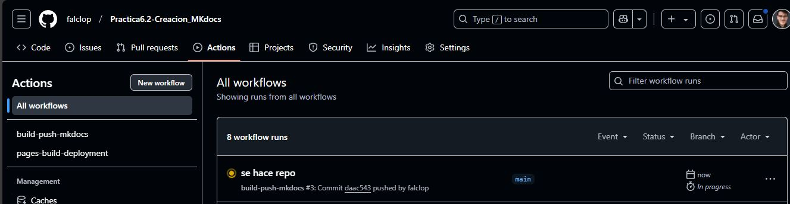
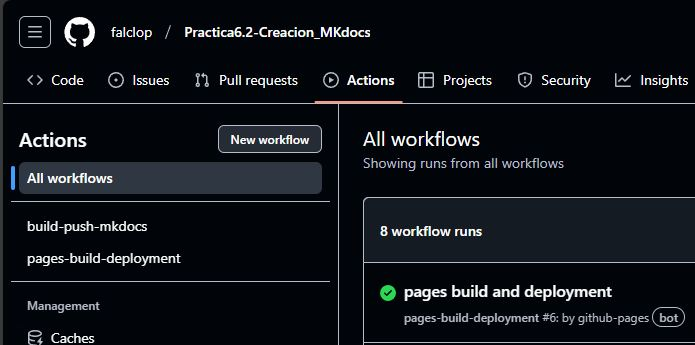
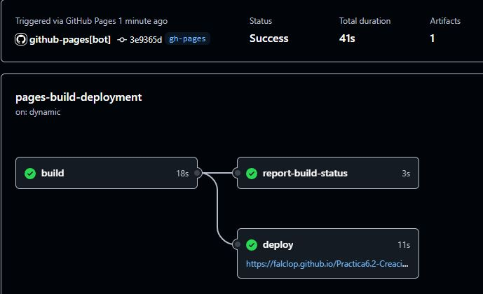
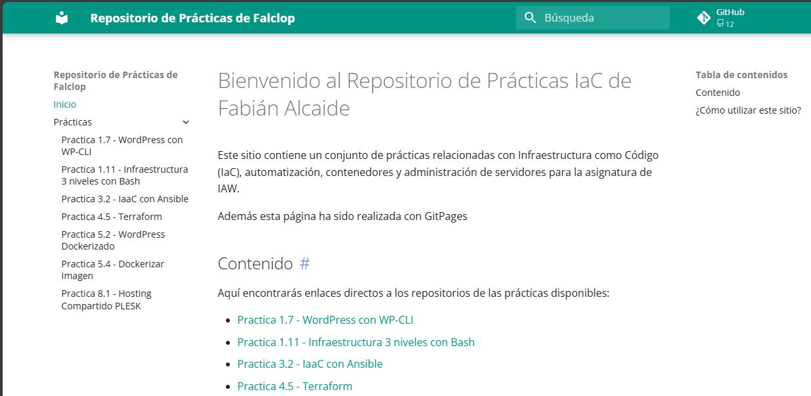
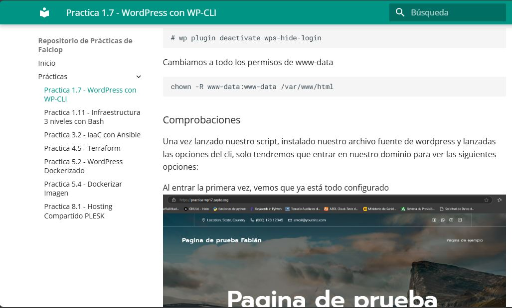
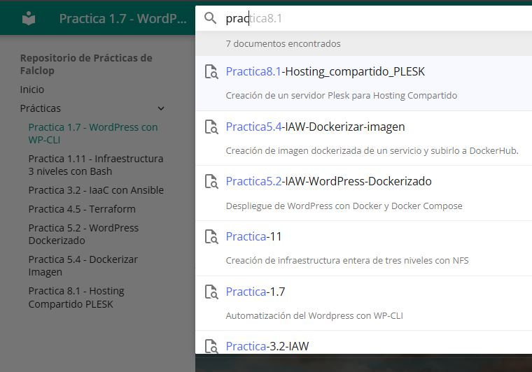
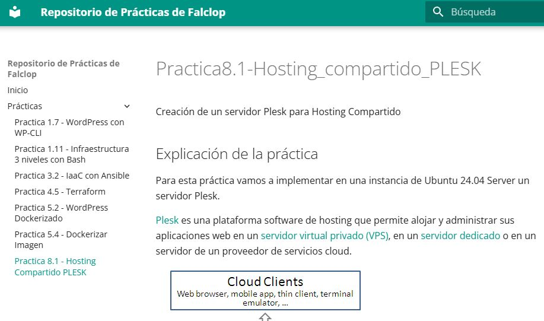
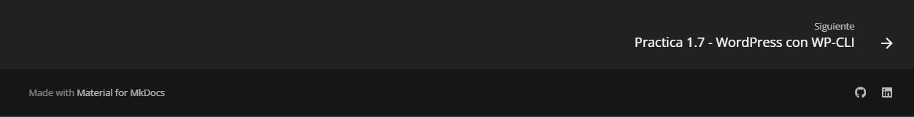

# Practica6.2-Creacion_MKdocs
Despliegue de una página estática con MKdocs
## Explicación de la práctica: Repositorio de Prácticas de Falclop

Este repositorio contiene un sitio web dinámico generado con **MkDocs Material**, en el que se documentan diferentes prácticas relacionadas con administración de sistemas, infraestructura como código y despliegue de aplicaciones.

## 🚀 Tecnologías utilizadas
- **MkDocs Material**: Framework para generar documentación estática
- **Markdown**: Lenguaje de marcado para escribir la documentación
- **GitHub Pages**: Hospedaje del sitio web
- **Docker Compose**: Para lanzar nuestro docker para crear el sitio

## 📁 Estructura del repositorio
```bash
/
├── docs/              # Contenido del sitio web
│   ├── img/           # Imágenes utilizadas en la documentación
│   ├── index.md       # Página principal
│   ├── p17.md         # Documentación de la práctica 1.7
│   ├── p111.md        # Documentación de la práctica 1.11
│   ├── ...
├── site/              # Dependencias del sitio html
├── mkdocs.yml         # Configuración de MkDocs
├── README.md          # Este archivo
├── start.sh           # Comandos para lanzar los dockers
```


## 🔧 Instalación y ejecución local
Para visualizar el sitio en tu máquina local:

1. Creamos nuestro archivo mkdocs.yml:
   ```yaml
   # Configuración del sitio
    site_name: "Repositorio de Prácticas de Falclop"  # Nombre del sitio web
    repo_url: "https://github.com/falclop"  # URL del repositorio en GitHub

    # Configuración del tema
    theme:
    name: "material"  # Tema utilizado (Material para MkDocs)
    palette:
        primary: teal  # Color principal del tema
    font:
        text: Open Sans  # Fuente del texto principal
    language: es  # Idioma del sitio
    
    features:
        # Carga instantánea de las páginas
        - navigation.instant
        # Ancla de navegación para seguir la sección activa
        - navigation.tracking
        # Menús expandibles en la navegación
        - navigation.expand
        # Funciones de búsqueda mejoradas
        - search.suggest
        - search.highlight
        # Oculta la cabecera al hacer scroll
        - header.autohide
        # Agrega un pie de página con navegación
        - navigation.footer

    # Extra (Configuración adicional fuera del tema)
    extra:
    social:
        # Icono de GitHub con enlace al perfil
        - icon: fontawesome/brands/github
        link: https://github.com/falclop
        # Icono de LinkedIn con enlace al perfil
        - icon: fontawesome/brands/linkedin
        link: https://www.linkedin.com/in/fabianalcaidelopez1991/

    # Configuración de la barra de navegación
    nav:
    - Inicio: index.md  # Página de inicio
    - Prácticas:
        # Listado de prácticas con enlaces a sus respectivas páginas Markdown
        - "Practica 1.7 - WordPress con WP-CLI": p17.md
        - "Practica 1.11 - Infraestructura 3 niveles con Bash": p111.md
        - "Practica 3.2 - IaaC con Ansible": p32.md
        - "Practica 4.5 - Terraform": p45.md
        - "Practica 5.2 - WordPress Dockerizado": p52.md
        - "Practica 5.4 - Dockerizar Imagen": p54.md
        - "Practica 8.1 - Hosting Compartido PLESK": p8.md

    # Extensiones para mejorar Markdown
    markdown_extensions:
    - toc:
        permalink: "#"  # Agrega enlaces ancla en los títulos
    - pymdownx.highlight  # Resaltado de código
    - pymdownx.inlinehilite  # Resaltado en línea de código
    - pymdownx.superfences  # Soporte mejorado para bloques de código
    - pymdownx.emoji  # Soporte para emojis
   ```
2. Lanzamos el contenedor que hará la build del sitio y el despliegue en GitHub Sites:
   ```bash
   docker run --rm -it -p 8000:8000 --user $(id -u):$(id -g) -v "$PWD":/docs squidfunk/mkdocs-material build

   docker run --rm -it -p 8000:8000 --user $(id -u):$(id -g) -v "$PWD":/docs squidfunk/mkdocs-material gh-deploy
   ```
     

   
3. Abre en tu navegador: https://falclop.github.io/Practica6.2-Creacion_MKdocs/

## 🌐 Despliegue en GitHub Pages
El sitio se despliega automáticamente en GitHub Pages cada vez que se actualiza la rama principal. Esto lo conseguimos creando una GitHub Action:
```yaml
name: build-push-mkdocs

# Eventos que desescandenan el workflow
on:
  push:
    branches: ["main"]

  workflow_dispatch:

# A workflow run is made up of one or more jobs that can run sequentially or in parallel
jobs:

  # Job para crear la documentación de mkdocs
  build:
    # Indicamos que este job se ejecutará en una máquina virtual con la última versión de ubuntu
    runs-on: ubuntu-latest
    
    # Definimos los pasos de este job
    steps:
      - name: Clone repository
        uses: actions/checkout@v4

      - name: Install Python3
        uses: actions/setup-python@v4
        with:
          python-version: 3.x

      - name: Install Mkdocs
        run: |
          pip install mkdocs
          pip install mkdocs-material 

      - name: Build MkDocs
        run: |
          mkdocs build

      - name: Push the documentation in a branch
        uses: s0/git-publish-subdir-action@develop
        env:
          REPO: self
          BRANCH: gh-pages # The branch name where you want to push the assets
          FOLDER: site # The directory where your assets are generated
          GITHUB_TOKEN: ${{ secrets.GITHUB_TOKEN }} # GitHub will automatically add this - you don't need to bother getting a token
          MESSAGE: "Build: ({sha}) {msg}" # The commit message
```
  

  

  

## 👹 Comprobaciones del sitio  

Cuando accedemos a nuestro sitio veremos esto:

### index.md de nuestro sitio
  

### Comprobación de una entrada
  

### Implementación de barra de búsqueda con ancla de contenido
  

### Última entrada
  

### Footer con display de navegación e iconos de GitHub y Linkdin
  

## 📌 Enlaces de interés
- [Sitio web en GitHub Pages](https://falclop.github.io/Practica6.2-Creacion_MKdocs/)
- [Repositorio en GitHub](https://github.com/falclop)

## ✨ Autor
Creado por [Fabián Alcaide López](https://www.linkedin.com/in/fabianalcaidelopez1991/)
