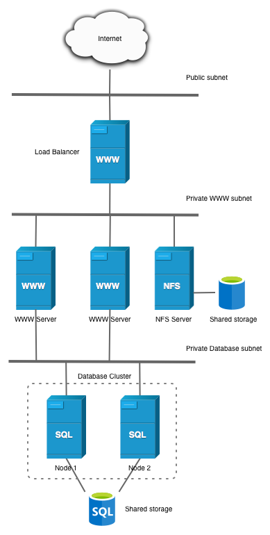
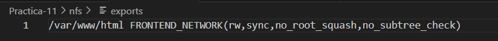
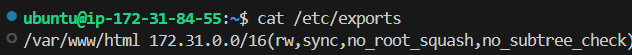
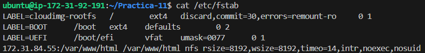
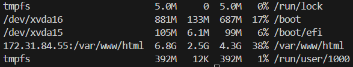

# Practica-11  
Creación de infraestructura entera de tres niveles con NFS  

## Desarrollo de la práctica  
En la siguiente práctica vamos a desarrollar una arquitectura en tres niveles de despliegue de aplicaciones web, en ella vamos a contar con:  
* Un balanceador de carga con **nginx**
* Dos máquinas front-end con apache 2.4
* Una máquina back-end con mysql
* Una máquina servidor NFS que hace de almacenaje compartido para las máquinas front-end  

La estructura que vamos a crear va a seguir el siguiente diagrama  

  

Para ello seguiremos el despliegue siguiendo los pasos de la práctica anterior pero implementando una máquina con NFS compartido.

## Despliegue de la práctica  
Como hemos comentado, toda la práctica se va a basar en despliegue anterior que podemos ver en el [siguiente enlace](https://github.com/falclop/Practica-1.10) A la cual le añadiremos el despliegue de una nueva máquina, a la que llamaremos server-nfs.  

Esta máquina la desplegaremos con el siguiente script  
```
#Actualizar el repositorio
apt update
```
```
#Actualiza el paquete
apt upgrade -y
```
```
#Instalamos los paquetes del servidor nfs
sudo apt install nfs-kernel-server -y
```
```
#Creamos el directorio a compartir, en este caso html en /var/www
mkdir -p /var/www/html
```
```
#Eliminamos tanto el propietario como el grupo al que pertenece el directorio
chown nobody:nogroup /var/www/html
```
Antes de seguir, debemos aclarar que debemos tener en nuestro repositorio el siguiente archivo exports.  

```
#Copiamos el archivo de las opciones de como se exportará el directorio
cp ../nfs/exports /etc/exports
```
```
#Añadimos a dicho archivo de configuración las redes a las que hará referencia
sed -i "s#FRONTEND_NETWORK#$FRONTEND_NETWORK#" /etc/exports
```
Después de esta línea veremos como el archivo se mantiene de esta forma.  

```
#Reiniciamos el servidor
systemctl restart nfs-kernel-server
```  

Una vez hemos instalado el cliente, vamos a crear un script que vamos a lanzar en cada uno de las máquinas y denominaremos setup_nfs_client

```
#Actualizar el repositorio
apt update
```
```
#Actualiza el paquete
apt upgrade -y
```
```
#Instalamos el cliente
sudo apt install nfs-common -y
```
```
#Montamos la carpeta en el directorio, con df -h podemos comprobarlo
mount $NFS_SERVER_IP:/var/www/html /var/www/html
```
```
#Creamos una copia de seguridad de fstab
cp /etc/fstab /etc/fstab.bak
```
```
#Creamos una entrada de acceso directo a fstab para garantizar que se monte al arranque de cada máquina mount -a
sed -i '/UEFI/a 172.31.84.55:/var/www/html /var/www/html nfs rsize=8192,wsize=8192,timeo=14,intr,noexec,nosuid' /etc/fstab
```  


Después de lanzar nuestro script podemos ver como en las máquinas de front-end el directorio /var/www/html esta montado sobre la máquina nfs.  

  

Para concluir vamos a decir el orden en el que debemos lanzar los scripts.  

loadbalancer 
- setup_loadbalancer
- setup_letsencrypt

frontend 1 y 2
- install_lamp_frontend
- deploy_wordpress_frontend
- setup_nfs_client

backend
- install_lamp_backend
- deploy_wordpress_backend

server nfs
- setup_nfs_server