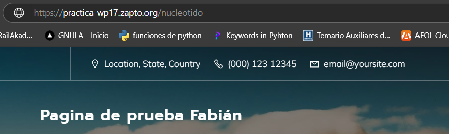
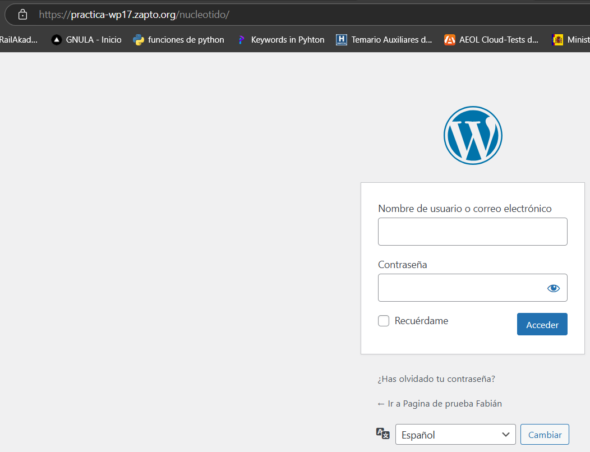
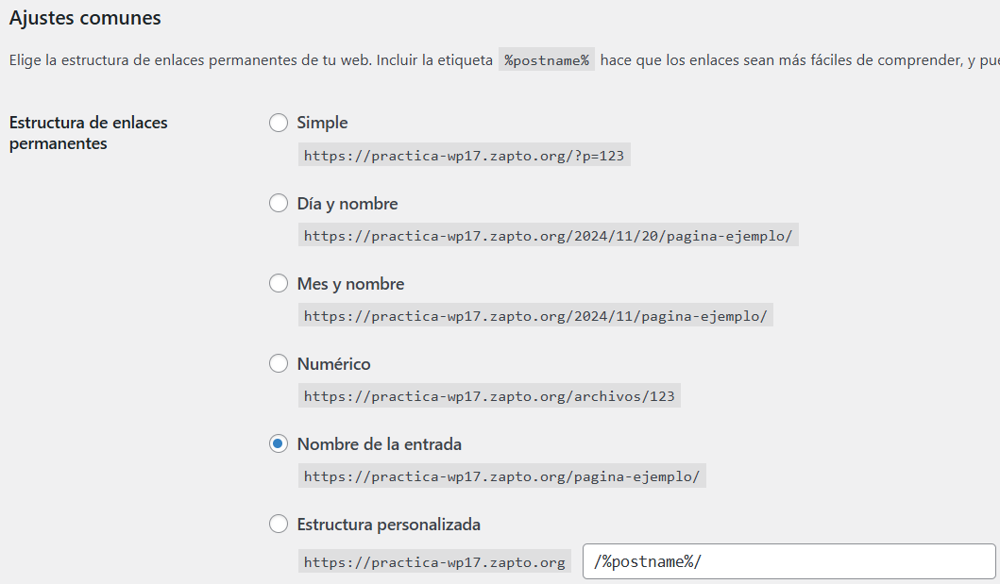
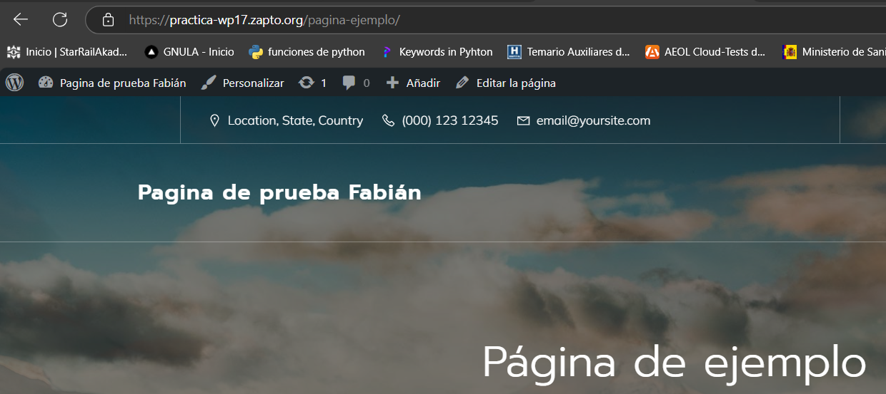
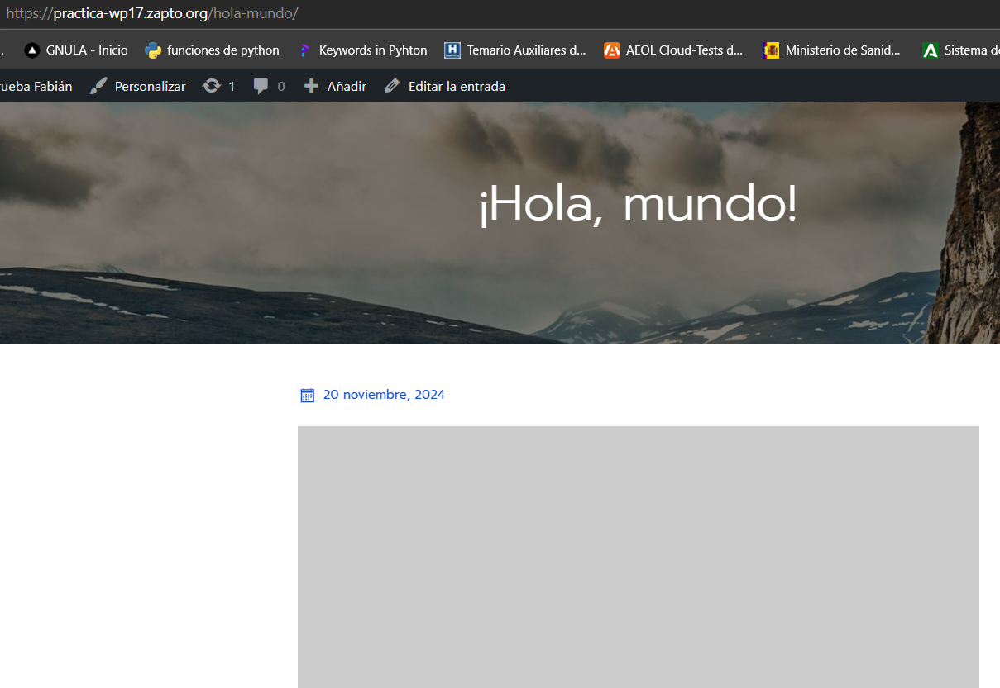

# Practica-1.7

Automatización del Wordpress con WP-CLI

## Desarrollo de la práctica

En esta práctica vamos a seguir la misma hoja de ruta que la práctica 1.6 pero con la diferencia del uso de **WP-CLI**, una aplicación de wordpress, que nos ayuda a implementar nuestro sitio web de forma completamente autónoma dónde solo debemos establecer las variables de entorno para nombre del sitio, idioma o credenciales de administrador y el sitio será desplegado de forma completamente autónoma.  

Junto a esto veremos también la automatización de la instalación de temas y aplicaciones que nos ayudan a complementar nuestra máquina como wp-hide-login, que oculta la página de wp-login.php, desviando las miradas indiscretas de las partes críticas de nuestro sistema.

## Script de despliegue

Debemos tener en cuenta el despliegue de estos script:
* Preparamos el archivo .env con la plantilla .env.example
* Registramos un dominio válido para nuestro sitio
* Arrancamos install_lamp.sh
* Arrancamos setup_letsencrypt_certificate

Y preparamos nuestro script de deploy con las siguientes características:  

Eliminamos instalaciones anteriores
```
rm -rf /opt/*
```  

Descargamos el código fuente de wp cli (man es manual / export para ver variables de entorno de la sesión)
```
wget https://raw.githubusercontent.com/wp-cli/builds/gh-pages/phar/wp-cli.phar -P /tmp
```  
Damos permisos de ejecución al archivo

```
chmod +x /tmp/wp-cli.phar
```  
Movemos el script a usr/local/bin/
```
mv /tmp/wp-cli.phar /usr/local/bin/wp
```  
Eliminamos instalaciones anteriores
```
rm -rf /var/www/html/*
```
Instalamos worpress con el cli y las opciones wp core
```
wp core download --locale=es_ES --path=$WP_PATH --allow-root
```
Creamos la base de datos de wordpress
```
mysql -u root <<< "DROP DATABASE IF EXISTS $WORDPRESS_DB_NAME"
mysql -u root <<< "CREATE DATABASE $WORDPRESS_DB_NAME"
mysql -u root <<< "DROP USER IF EXISTS $WORDPRESS_DB_USER@$IP_CLIENTE_MYSQL"
mysql -u root <<< "CREATE USER $WORDPRESS_DB_USER@$IP_CLIENTE_MYSQL IDENTIFIED BY '$WORDPRESS_DB_PASSWORD'"
mysql -u root <<< "GRANT ALL PRIVILEGES ON $WORDPRESS_DB_NAME.* TO $WORDPRESS_DB_USER@$IP_CLIENTE_MYSQL"
```
Creamos el archivo de configuración
```
wp config create \
  --dbname=$WORDPRESS_DB_NAME \
  --dbuser=$WORDPRESS_DB_USER \
  --dbpass=$WORDPRESS_DB_PASSWORD \
  --dbhost=$IP_CLIENTE_MYSQL \
  --path=$WP_PATH \
  --allow-root
```
Creamos el sitio de wordpress
```
wp core install \
  --url=$URL \
  --title="$WP_TITLE" \
  --admin_user=$WP_USER \
  --admin_password=$WP_PASS \
  --admin_email=$WP_EMAIL \
  --path=$WP_PATH \
  --allow-root
```
Cambiamos a todo los permisos de www-data
```
chown -R www-data:www-data /var/www/html
```
Activamos la rescritura de los permalinks o enlaces permanentes 
```
wp rewrite structure '/%postname%/' \
  --path=$WP_PATH \
  --allow-root
```
Copiamos nuestro archivo .htaccess para activar los permalinks
```
cp ../htaccess/.htaccess $WP_PATH
```
Instalamos y activamos el theme elegido
```
wp theme install mindscape --activate --path=$WP_PATH --allow-root
```
Instalamos el plugin para ocultar nuestro archivo wp-admin
```
wp plugin install wps-hide-login --activate --path=$WP_PATH --allow-root
```
Configuramos el plugin ocultador de wp-login
```
wp option update whl_page $nombre_secreto --path=$WP_PATH --allow-root
```
Desactivamos un plugin, esto es un extra. Para saber como desactivar un plugin
```
# wp plugin deactivate wps-hide-login
```
Cambiamos a todo los permisos de www-data
```
chown -R www-data:www-data /var/www/html
```

### Comprobaciones
Una vez lanzado nuestro script, instalado nuestro archivo fuente de wordpress y lanzadas las opciones del cli, solo tendremos que entrar en nuestro dominio para ver las siguientes opciones:  

Al entrar la primera vez, vemos que ya está todo configurado  
  

Comprobamos que el ocultamiento de wp-login funciona  
  
  
  

Comprobamos los permalinks  
  

  

Entrada hola mundo!
  