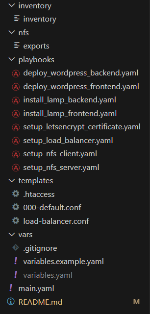
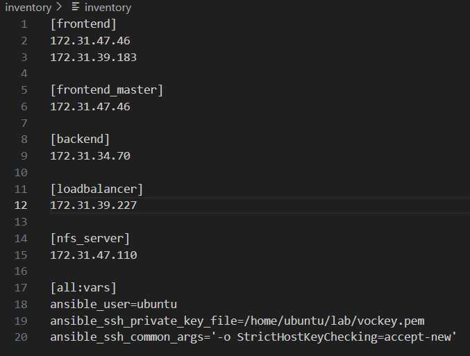
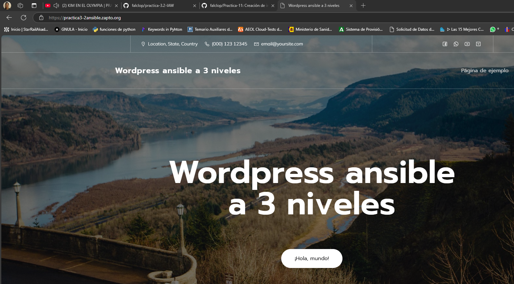
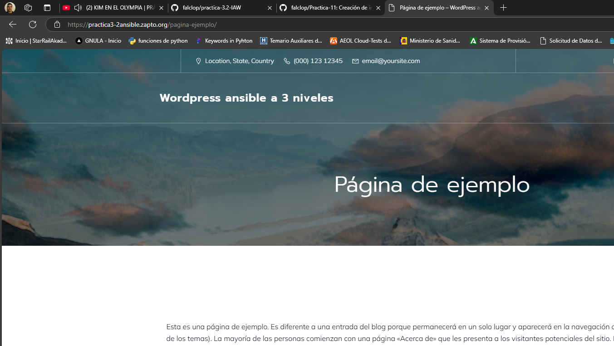

# Practica-3.2-IAW
## Despliegue de Wordpress en tres niveles mediante Ansible
En esta práctica vamos a realizar un despliegue de un sitio de moodle siguiendo la misma pauta de la [práctica 11](https://github.com/falclop/Practica-11), una infraestructura a tres niveles (balanceador de carga, frontend y backend) en máquinas diferentes siguiendo el siguiente esquema.  
  

En este esquema, el balanceador de carga tendrá un certificado Let's Encrypt, las máquinas de frontend tienen el directorio /var/www/html de apache2, compartido por una máquina nfs_server y al final una máquina backend (no dos como en la imagen) con el servicio de MySQL.  

## Explicación del repositorio
Este repositorio tiene todo lo necesario para el lanzamiento de este sitio CMS (Content Manager System), en este caso WordPress. La estructura global de nuestro repo será la siguiente:  

  

- El **inventory**, será el archivo donde colocamos las diferentes ip de las máquinas que pertenecen a nuestros grupos.  
  

Las últimas líneas se alude a las claves ssh que deben estar en la máquina para el funcionamiento de Ansible.  

- **exports**, el archivo que especifica el comportamiento del directorio a compartir (irá en la máquina nfs_server).
```
/var/www/html FRONTEND_NETWORK(rw,sync,no_root_squash,no_subtree_check)
```  

- Los **playbooks**, serán los diferentes "libros de jugadas" donde se colocan lás tareas que se ejecutan. Aquí tendremos:
    - **install_lamp_backend.yaml**  
        Instalación de los paquetes de LAMP de Backend: MySQL.  

    - **install_lamp_frontend.yaml**  

        Instalación de los paquetes de LAMP de Frontend: Apache2 y PHP.

    - **setup_load_balancer.yaml**  

        Instalación de las dependecias del balanceador de carga.  

    - **setup_nfs_server.yaml**  

        Instalación de las dependencias del servidor NFS.

    - **setup_nfs_client.yaml**  

        Instalación de las dependecias para montar el volumen /var/www/html en las máquinas frontend.  

    - **setup_letsencrypt_certificate.yaml**  

        Instalación y petición de certificado Let's Encrypt para la máquina balanceador de carga.  

    - **deploy_wordpress_backend.yaml**  

        Instalación de dependencias de backend de WP: bases de datos.  

    - **deploy_wordpress_frontend.yaml**  

        Instalación de dependencias de frontend de WP: instalación de CLI, plugins, y reescritura de permalinks.  

## Instalación de scripts
El núcleo fuerte del repositorio será la instalación de wordpress, para ello una vez tenemos la Pila LAMP instalada e instalamos el Let's Encrypt veremos como funciona el NFS Client y Server.  
- **Servidor NFS**
```
---
- name: Configurar servidor NFS
  hosts: nfs_server
  become: yes
  vars_files:
    - ../vars/variables.yaml

  tasks:
    - name: Actualizar el repositorio de paquetes
      apt:
        update_cache: yes

    - name: Actualizar paquetes del sistema
      apt:
        upgrade: dist
        autoremove: yes

    - name: Instalar el servidor NFS
      apt:
        name: nfs-kernel-server
        state: present

    - name: Crear el directorio compartido
      file:
        path: /var/www/html
        state: directory
        owner: nobody
        group: nogroup
        mode: '0775'

    - name: Copiar configuración de exportación NFS
      copy:
        src: ../nfs/exports
        dest: /etc/exports
        owner: root
        group: root
        mode: '0644'

    - name: Configurar la red de exportación en /etc/exports
      replace:
        path: /etc/exports
        regexp: 'FRONTEND_NETWORK'
        replace: "{{ ip.net }}"

    - name: Reiniciar el servicio NFS
      systemd:
        name: nfs-kernel-server
        state: restarted
        enabled: yes

```  
- **Clientes NFS**
```
---
- name: Configurar cliente NFS en servidores frontend
  hosts: frontend
  become: yes
  vars_files:
    - ../vars/variables.yaml

  tasks:
    - name: Actualizar el repositorio de paquetes
      apt:
        update_cache: yes

    - name: Actualizar paquetes del sistema
      apt:
        upgrade: dist
        autoremove: yes

    - name: Instalar el cliente NFS
      apt:
        name: nfs-common
        state: present

    - name: Crear el punto de montaje para NFS
      file:
        path: /var/www/html
        state: directory
        owner: www-data
        group: www-data
        mode: '0755'

    - name: Montar el sistema de archivos NFS temporalmente
      command: mount {{ ip.nfsserver }}:/var/www/html /var/www/html
      args:
        creates: /var/www/html/index.php  # Verifica que el montaje no se repita

    - name: Crear copia de seguridad de /etc/fstab
      copy:
        src: /etc/fstab
        dest: /etc/fstab.bak
        remote_src: yes
        mode: '0644'

    - name: Agregar la configuración de montaje de NFS a /etc/fstab
      lineinfile:
        path: /etc/fstab
        insertafter: 'UEFI'
        line: "{{ ip.nfsserver }}:/var/www/html /var/www/html nfs rsize=8192,wsize=8192,timeo=14,intr,noexec,nosuid"
        state: present

    - name: Montar todos los sistemas de archivos definidos en fstab
      command: mount -a

```
- **Despliegue backend**
```
---
- name: Despliegue de backend de wordpress
  hosts: backend
  become: yes
  vars_files:
    - ../vars/variables.yaml
    
  tasks:
    - name: Borrar la base de datos
      mysql_db:
        name: "{{ db.name }}"
        state: absent
        login_unix_socket: /var/run/mysqld/mysqld.sock
        
    - name: Crear una base de datos
      mysql_db:
        name: "{{ db.name }}"
        state: present
        login_unix_socket: /var/run/mysqld/mysqld.sock 

    - name: Crear el usuario de la base de datos
      mysql_user:         
        name: "{{ db.user }}"
        password: "{{ db.pass }}"
        priv: "{{ db.name }}.*:ALL"
        host: "{{ ip.net }}" #Aquí usamos la red completa 172.31.0.0/16
        state: present
        login_unix_socket: /var/run/mysqld/mysqld.sock 

    - name: Configuramos MySQL para permitir conexiones desde cualquier interfaz
      replace:
        path: /etc/mysql/mysql.conf.d/mysqld.cnf
        regexp: 127.0.0.1
        replace: 0.0.0.0

    - name: Reiniciamos el servicio de base de datos
      service:
        name: mysql
        state: restarted
```
- **Despliegue frontend**
```
---
- name: Deploy Moodle front
  hosts: frontend_master
  become: yes
  vars_files:
    - ../vars/variables.yaml

  tasks:
      - name: Eliminar instalaciones anteriores de wp-cli
        file:
          path: /tmp/wp-cli.phar
          state: absent

      - name: Descargar WP-CLI
        get_url:
          url: https://raw.githubusercontent.com/wp-cli/builds/gh-pages/phar/wp-cli.phar
          dest: /tmp/wp-cli.phar
          mode: '0755'

      - name: Mover wp-cli.phar a /usr/local/bin/wp
        command: mv /tmp/wp-cli.phar /usr/local/bin/wp
        args:
          creates: /usr/local/bin/wp

      - name: Eliminar contenido anterior de WordPress
        # En esta línea usamos shell en vez de file y state:absent ya que como necesitamos borrar el contenido 
        # y el directorio esta siendo usado por nfs, lo hacemos para evitar fallos
        shell: rm -rf /var/www/html/*

        # A partir de aquí vamos a usar el comando command, ya que no exiten comandos nativos en ansible para usar el CLI de wordpress
      - name: Descargar e instalar WordPress
        command: wp core download --locale=es_ES --path={{ wp.path }} --allow-root

      - name: Crear el archivo de configuración de WordPress
        command:
          wp config create \
          --dbname={{ db.name }} \ 
          --dbuser={{ db.user }} \
          --dbpass={{ db.pass }} \
          --dbhost={{ ip.back }} \
          --path={{ wp.path }} \
          --allow-root

      - name: Instalar WordPress
        command:
          wp core install \
          --url="https://{{ cerbot.url }}" \
          --title="{{ wp.title }}" \
          --admin_user={{ wp.user }} \ 
          --admin_password={{ wp.pass }} \
          --admin_email={{ wp.email }} \
          --path={{ wp.path }} \
          --allow-root

      - name: Establecer permisos de WordPress
        file:
          path: /var/www/html
          owner: www-data
          group: www-data
          recurse: yes

      - name: Configurar enlaces permanentes de WordPress
        command: wp rewrite structure '/%postname%/' --path={{ wp.path }} --allow-root

      - name: Copiar archivo .htaccess para activar permalinks
        copy:
          src: ../templates/.htaccess
          dest: "{{ wp.path }}/.htaccess"
          owner: www-data
          group: www-data
          mode: '0644'

      - name: Instalar y activar el tema Mindscape
        command: wp theme install mindscape --activate --path={{ wp.path }} --allow-root

      - name: Instalar y activar el plugin WPS Hide Login
        command: wp plugin install wps-hide-login --activate --path={{ wp.path }} --allow-root

      - name: Configurar la URL secreta de wp-admin
        command: wp option update whl_page {{ wp.nombre_secreto }} --path={{ wp.path }} --allow-root

      - name: Agregar configuración HTTPS en wp-config.php
        lineinfile:
          path: /var/www/html/wp-config.php
          line: "$_SERVER['HTTPS'] = 'on';"
          insertafter: "COLLATE"

      - name: Establecer permisos finales de WordPress
        file:
          path: /var/www/html
          owner: www-data
          group: www-data
          recurse: yes
```
## Comprobaciones
Una vez hemos lanzado todos los scripts y vemos como nos ha funcionado, veremos la siguiente pantalla.  
- **Funcionamiento normal**  

  

- **Reescritura de permalinks**  

  

- **Plugin de ocultamiento de login**  

