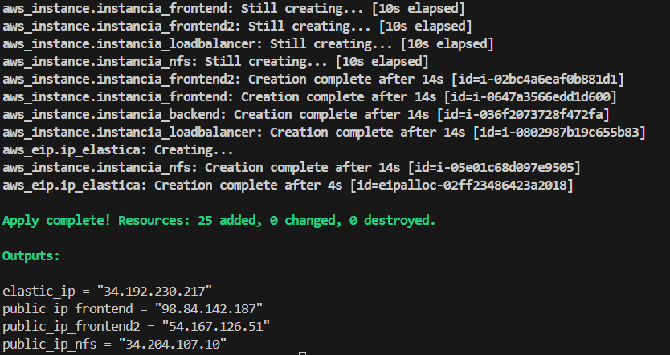

# Práctica-4.5-Terraform
Despliegue de infraestructuras usando el software terraform
## Desarrollo de la actividad
En la siguiente actividad vamos a usar el software terraform.  
Terraform es una software de código abierto desarrollado por Hashicorp que se coloca como intermediario entre el servicio de **cloud computing** y el equipo desde donde se disparan las ordenes.  

Este sistema se ha colocado como la principal herramienta para el IaaC (Infrastructure as a Code) y los profesionales del despliegue de infraestrutura por su versatilidad a la hora de crear códigos para despliegues de máquinas, y además por su facil unión con otras herramientas como **Ansible** o boto3 en python.

## El depliegue

Para la actividad primero vamos a conocer como funciona terraform, primero debemos crear los archivos variables.tf, main.tf y output.tf (ya que siempre es buena praxis diferenciar los documentos, ya que cuanta menos superficie de ataque mejor), estos archivos sigue el formato json, de diccionario clave = valor.  

**main.tf**
```
# Configuramos el proveedor de AWS
provider "aws" {
  region = var.region
}

# Creamos los grupos de seguridad
resource "aws_security_group" "grupo_seguridad_lb" {
  name        = var.sg_name_loadbalancer
  description = var.sg_description
}

resource "aws_security_group" "grupo_seguridad_nfs" {
  name        = var.sg_name_nfs
  description = var.sg_description
}

resource "aws_security_group" "grupo_seguridad_frontend" {
  name        = var.sg_name_frontend
  description = var.sg_description
}

resource "aws_security_group" "grupo_seguridad_backend" {
  name        = var.sg_name_backend
  description = var.sg_description
}

# Creamos las reglas de entrada del grupo de seguridad
resource "aws_security_group_rule" "ingress_load_balancer" {
  security_group_id = aws_security_group.grupo_seguridad_lb.id
  type              = "ingress"
  count             = length(var.allowed_ingress_ports_loadbalancer)
  from_port         = var.allowed_ingress_ports_loadbalancer[count.index]
  to_port           = var.allowed_ingress_ports_loadbalancer[count.index]
  protocol          = "tcp"
  cidr_blocks       = ["0.0.0.0/0"]
}

resource "aws_security_group_rule" "ingress_nfs" {
  security_group_id = aws_security_group.grupo_seguridad_nfs.id
  type              = "ingress"
  count             = length(var.allowed_ingress_ports_nfs)
  from_port         = var.allowed_ingress_ports_nfs[count.index]
  to_port           = var.allowed_ingress_ports_nfs[count.index]
  protocol          = "tcp"
  cidr_blocks       = ["0.0.0.0/0"]
}

resource "aws_security_group_rule" "ingress_frontend" {
  security_group_id = aws_security_group.grupo_seguridad_frontend.id
  type              = "ingress"
  count             = length(var.allowed_ingress_ports_frontend)
  from_port         = var.allowed_ingress_ports_frontend[count.index]
  to_port           = var.allowed_ingress_ports_frontend[count.index]
  protocol          = "tcp"
  cidr_blocks       = ["0.0.0.0/0"]
}

resource "aws_security_group_rule" "ingress_backend" {
  security_group_id = aws_security_group.grupo_seguridad_backend.id
  type              = "ingress"
  count             = length(var.allowed_ingress_ports_backend)
  from_port         = var.allowed_ingress_ports_backend[count.index]
  to_port           = var.allowed_ingress_ports_backend[count.index]
  protocol          = "tcp"
  cidr_blocks       = ["0.0.0.0/0"]
}

# Creamos las reglas de salida del grupo de seguridad
# Para ello usamos un bucle for_each para recorrer los grupos de seguridad
resource "aws_security_group_rule" "egress_all" {
  for_each         = {
    lb = aws_security_group.grupo_seguridad_lb.id,
    nfs = aws_security_group.grupo_seguridad_nfs.id,
    frontend = aws_security_group.grupo_seguridad_frontend.id,
    backend = aws_security_group.grupo_seguridad_backend.id
  }
  security_group_id = each.value
  type              = "egress"
  from_port         = 0
  to_port           = 0
  protocol          = "-1"
  cidr_blocks       = ["0.0.0.0/0"]
}

# Creamos las instancias EC2
resource "aws_instance" "instancia_loadbalancer" {
  ami             = var.ami_id
  instance_type   = var.instance_type
  key_name        = var.key_name
  security_groups = [aws_security_group.grupo_seguridad_lb.name]

  tags = {
    Name = var.instance_name_loadbalancer
  }
}

resource "aws_instance" "instancia_nfs" {
  ami             = var.ami_id
  instance_type   = var.instance_type
  key_name        = var.key_name
  security_groups = [aws_security_group.grupo_seguridad_nfs.name]
  tags = {
    Name = var.instance_name_nfs
  }
}

resource "aws_instance" "instancia_frontend" {
  ami             = var.ami_id
  instance_type   = var.instance_type
  key_name        = var.key_name
  security_groups = [aws_security_group.grupo_seguridad_frontend.name]
  tags = {
    Name = var.instance_name_frontend
  }
}

resource "aws_instance" "instancia_frontend2" {
  ami             = var.ami_id
  instance_type   = var.instance_type
  key_name        = var.key_name
  security_groups = [aws_security_group.grupo_seguridad_frontend.name]
  tags = {
    Name = var.instance_name_frontend2
  }
}

resource "aws_instance" "instancia_backend" {
  ami             = var.ami_id
  instance_type   = var.instance_type
  key_name        = var.key_name
  security_groups = [aws_security_group.grupo_seguridad_backend.name]
  tags = {
    Name = var.instance_name_backend
  }
}

# Creamos una IP elástica y la asociamos a la instancia
resource "aws_eip" "ip_elastica" {
  instance = aws_instance.instancia_loadbalancer.id
}
```  

**variables.tf**
```
variable "region" {
  description = "Región de AWS donde se creará la instancia"
  type        = string
  default     = "us-east-1"
}

variable "allowed_ingress_ports_loadbalancer" {
  description = "Puertos de entrada del grupo de seguridad loadbalancer"
  type        = list(number)
  default     = [22, 80, 443]
}

variable "allowed_ingress_ports_nfs" {
  description = "Puertos de entrada del grupo de seguridad nfs"
  type        = list(number)
  default     = [22, 2049]
}

variable "allowed_ingress_ports_backend" {
  description = "Puertos de entrada del grupo de seguridad backend"
  type        = list(number)
  default     = [22, 3306]
}

variable "allowed_ingress_ports_frontend" {
  description = "Puertos de entrada del grupo de seguridad frontend"
  type        = list(number)
  default     = [22, 2049, 443, 80]
}

variable "sg_name_loadbalancer" {
  description = "Nombre del grupo de seguridad"
  type        = string
  default     = "sg_loadbalancer"
}

variable "sg_name_nfs" {
  description = "Nombre del grupo de seguridad"
  type        = string
  default     = "sg_nfs"
}

variable "sg_name_frontend" {
  description = "Nombre del grupo de seguridad"
  type        = string
  default     = "sg_frontend"
}

variable "sg_name_backend" {
  description = "Nombre del grupo de seguridad"
  type        = string
  default     = "sg_backend"
}

variable "sg_description" {
  description = "Descripción del grupo de seguridad"
  type        = string
  default     = "Grupo de seguridad para ejercicio terraform"
}

variable "ami_id" {
  description = "Identificador de la AMI"
  type        = string
  default     = "ami-04b4f1a9cf54c11d0"
}

variable "instance_type" {
  description = "Tipo de instancia"
  type        = string
  default     = "t2.micro"
}

variable "key_name" {
  description = "Nombre de la clave pública"
  type        = string
  default     = "vockey"
}

variable "instance_name_backend" {
  description = "Nombre de la instancia"
  type        = string
  default     = "instancia_backend"
}

variable "instance_name_frontend" {
  description = "Nombre de la instancia"
  type        = string
  default     = "instancia_frontend"

}

variable "instance_name_frontend2" {
  description = "Nombre de la instancia"
  type        = string
  default     = "instancia_frontend2"

}

variable "instance_name_loadbalancer" {
  description = "Nombre de la instancia"
  type        = string
  default     = "instancia_loadbalancer"
}

variable "instance_name_nfs" {
  description = "Nombre de la instancia"
  type        = string
  default     = "instancia_nfs"
}

```  

**output.tf**  
```
# Mostramos la IP pública de la instancia
output "elastic_ip" {
  value = aws_eip.ip_elastica.public_ip
}

output "public_ip_nfs" {
  value = aws_instance.instancia_nfs.public_ip
}

output "public_ip_frontend" {
  value = aws_instance.instancia_frontend.public_ip
}

output "public_ip_frontend2" {
  value = aws_instance.instancia_frontend2.public_ip
}
```  

Una vez tenemos los documentos, debemos conocer la secuencia de comandos:  
- **terraform init**: inicia el entorno de trabajo para terraform.  

  

- **terraform fmt**: formatea el documento main para que cumpla la forma correcta.

- **terraform plan**: da una vista previa de los comandos y las actuaciones que se van a ejecutar.  

  

- **terraform apply**: ejecuta las órdenes del main.tf.  

  

Como vemos nos pide una confirmación, para evitarla podemos poner la opción **-auto-approve**
  

Además como podemos comprobar, la salida que nos muestra es las diferentes variables que programamos en **output.tf**  

### Comprobaciones
Si vamos a nuestro laboratorio de AWS veremos las instancias, la ip elástica y los grupos de seguridad, creados y asignados.  

  

  

