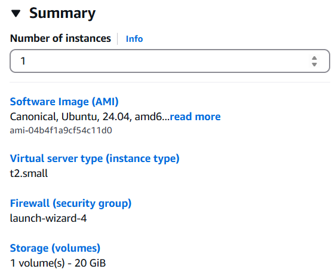
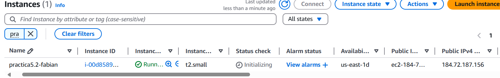
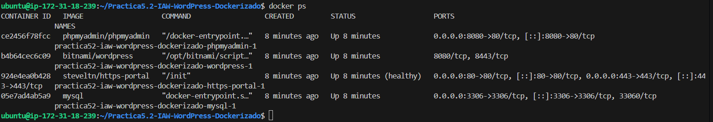
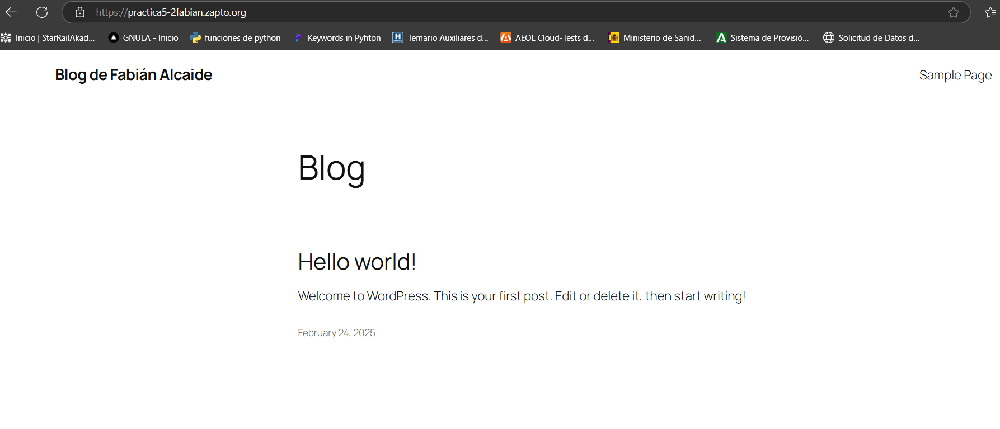

# Practica5.2-IAW-WordPress-Dockerizado
Despliegue de WordPress con Docker y Docker Compose
## Explicación de la práctica
Para la siguiente práctica vamos a crear una estructura de back y front de **wordpress**, junto a una máquina que realiza los retos de **Let's Encrypt**, todo ello mediante aplicaciones contenedorizados, siguiendo la siguiente estructura:  

  

Para ello vamos a desarrollar un documento docker-compose.yml donde se especifican las máquinas que se van a crear.  

### Comandos a usar con docker-compose
**docker ps**: Ver los contenedores activas.  

**docker compose up -d**: Lanza las instrucciones que se encuentran en el docker-compose.yml.  

**docker compose down -v**: Destruye todos los contenedores junto a volumenes, dependencias y redes.  

**docker logs**: Muestra los logs del contenedor que pongamos.  

**docker images**: Ver las imágenes que nos hemos descargados de contenedores.  

**docker system events**: Ver los eventos del sistema en docker.  
## Desarrollo de la práctica
Primero tendremos una instancia limpia para poder trabajar con las siguientes características.  



Luego obtenemos una ip elástica para nuestra instancia.  



Para ello vamos a tirar primero el script install_docker.sh, con ello aseguramos la descarga de docker-compose de último modelo.  

Una vez tenemos el sistema preparado elaboramos la siguiente hoja:  
- Creación de servicio **mysql** 
```
services:
  mysql:
    image: mysql
    ports: 
      - 3306:3306
    environment: 
      - MYSQL_ROOT_PASSWORD=${WORDPRESS_DATABASE_PASSWORD}
      - MYSQL_DATABASE=${WORDPRESS_DATABASE_NAME}
      - MYSQL_USER=${WORDPRESS_DATABASE_USER}
      - MYSQL_PASSWORD=${WORDPRESS_DATABASE_PASSWORD}
    volumes: 
      - mysql_data:/var/lib/mysql
    networks: 
      - backend-network
    restart: always
```  
- Creación de servicio **phpmyadmin**
```
  phpmyadmin:
    image: phpmyadmin/phpmyadmin
    ports:
      - 8080:80
    environment: 
      - PMA_HOST=mysql
    networks: 
      - backend-network
      - frontend-network
    restart: always
    depends_on: 
      - mysql
```  
- Creación de servicio **wordpress**  

```
  wordpress:
    image: bitnami/wordpress
    environment:
      - WORDPRESS_DATABASE_HOST=${WORDPRESS_DATABASE_HOST}
      - WORDPRESS_DATABASE_USER=${WORDPRESS_DATABASE_USER}
      - WORDPRESS_DATABASE_PASSWORD=${WORDPRESS_PASSWORD}
      - WORDPRESS_DATABASE_NAME=${WORDPRESS_DATABASE_NAME}
      - WORDPRESS_BLOG_NAME=${WORDPRESS_BLOG_NAME}
      - WORDPRESS_USERNAME=${WORDPRESS_USERNAME}
      - WORDPRESS_PASSWORD=${WORDPRESS_PASSWORD}
      - WORDPRESS_EMAIL=${WORDPRESS_EMAIL}
    volumes:
      - wordpress_data:/bitnami/wordpress
    depends_on:
      - mysql
    restart: always
    networks:
      - frontend-network
      - backend-network
```  
- Creación de servicio **https-portal**  

```
  https-portal:
    image: steveltn/https-portal
    ports:
      - 80:80
      - 443:443
    restart: always
    environment:
      DOMAINS: "${DOMAIN} -> http://wordpress:8080"
      STAGE: 'production' # Don't use production until staging works
      # FORCE_RENEW: 'true'
    networks:
      - frontend-network
```  

```
volumes:
  mysql_data:
  wordpress_data:

networks: 
  backend-network:
  frontend-network:
```    

Una vez elaborado el documento, lo lanzamos y vemos que se crear tanto el volumen, las redes y los contenedores.  

  

Y finalmente todo irá funcionando poco a poco, cuando los puertos estén bien conformado, el port-forwarding funciona, accedemos a la url.  

  

Y phpmyadmin.  


### Enlaces 
- Enlace del blog: https://practica5-2fabian.zapto.org/

- Enlace a phpmyadmin: https://practica5-2fabian.zapto.org:8080