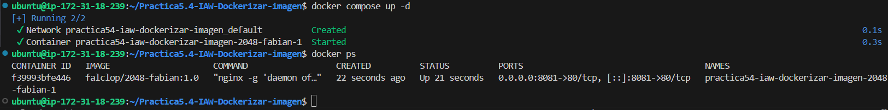
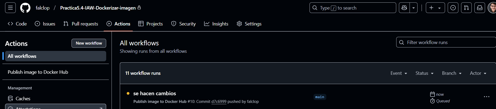

# Practica5.4-IAW-Dockerizar-imagen
Creación de imagen dockerizada de un servicio y subirlo a DockerHub.

## Explicación de la práctica
En esta práctica vamos a implementar la creación de un docker con un web estática, el juego del 2048, usando la tecnología docker compose.  
Los pasos a seguir serán los siguientes:  
- Crear un **Dockerfile**.  
- Crear una imagen de docker con **Docker Buildx**.  
- Crear el **docker-compose.yml** para despliegue de imagen.
- Despliegue de aplicación y comprobación.
- Subir imagen a **docker hub**, podemos verla [aquí](https://hub.docker.com/r/falclop/2048-fabian).
- Creación de **GitHub Actions** para implementar CI/CD.

## Desarrollo de la aplicación 
1. Dockerfile  
Un Dockerfile es un archivo que contiene las instrucciones para la creación de una imagen de docker. Esta se compone de varias partes, que pueden ser reutilizables y hacen que se comporte de diferentes formas:  
- El **FROM** hace referencia a la imagen desde la que comienza, en este caso un ubuntu 24.04.
```
FROM ubuntu:24.04
```
- Las **LABEL** introducen metadatos para trazabilidad y seguimiento del proyecto.
```
LABEL AUTHOR="Fabián Alcaide"
LABEL DESCRIPTION="Imagen de web 2028"
```
- El **RUN** es de lo más importante del Dockerfile, pues contiene los comandos que se ejecutarán al inicio del contenedor, en este caso:
    - Instalación de nginx.
    - Instalación de git.
    - Borrado de dependencias.
    - Clonado de repositorio necesario.
    - Copia de archivos a directorio virtual.
```
RUN apt update && \
    apt install nginx -y && \
    apt install git -y && \
    rm -rf /var/lib/apt/lists/*

RUN git clone https://github.com/josejuansanchez/2048 /app && \
    mv /app/* /var/www/html
```
- **EXPOSE** abre los puertos designados (recordemos que hay que abrir los puertos en la máquina anfitrión).
```
EXPOSE 80
```
- **CMD** permite ejecutar comandos como si fuese la consola.
```
CMD [ "nginx", "-g", "daemon off;" ]
```
2. Una vez tenemos el **Dockerfile** listo, usamos el comando:
```
docker build -t falclop/2048-fabian:1.0 .
```
Este comando permite poner nombre (tag), versión y localización del **dockerfile**. Le ponemos nuestro nombre a la imagen para poder subirlo como imagen en **DockerHub** como no oficial.

  

Una vez lanzamos el script, vemos nuestra imagen con **Docker images**  

  

3. Una vez tenemos las imagen, preparamos el **docker-compose.yml**  
```
services:
  2048-fabian:
    image: falclop/2048-fabian:1.0
    ports: 
      - 8081:80
```
Lo lanzamos con:
```
docker compose up -d
```  

  

Y como hemos hecho un port-forwarding al **8081:80** entramos a la ip o al nombre del dominio y veremos la aplicación.  

  

4. Cuando tenemos listo la imagen, la instalación es correcta y funciona todo, podemos subir la imagen a nuestra cuenta de **DockerHub**, para ello primero haremos:
```
docker login
```

  

Con esto podemos loguearnos en dockerhub para subirlo y poder hacer un **push**.

```
docker push falclop/2048-fabian:1
```

Con esto subimos la imagen a **dockerhub**  

  

  

5. Finalmente, vamos a crear un disparador en GitHub Actions para poder crear una automatización de CI/CD (Integración y Despliegue continuo). Para ello dentro de nuestro repositorio entramos en **Actions** y el botón **New Workflow**.  


Nos creará una carpeta oculta en el que meter los diferentes disparadores, el nuestro será el siguiente:
```
name: Publish image to Docker Hub

# This workflow uses actions that are not certified by GitHub.
# They are provided by a third-party and are governed by
# separate terms of service, privacy policy, and support
# documentation.

on:
  push:
    branches: [ "main" ]
    # Publish semver tags as releases.
    tags: [ 'v*.*.*' ]
  workflow_dispatch:

env:
  # Use docker.io for Docker Hub if empty
  REGISTRY: docker.io
  # github.repository as <account>/<repo>
  #IMAGE_NAME: ${{ github.repository }}
  IMAGE_NAME: 2048-fabian
  IMAGE_TAG: latest

jobs:
  build:

    runs-on: ubuntu-latest
    permissions:
      contents: read
      packages: write

    steps:
      - name: Checkout repository
        uses: actions/checkout@v3

      # Set up BuildKit Docker container builder to be able to build
      # multi-platform images and export cache
      # https://github.com/docker/setup-buildx-action
      - name: Set up Docker Buildx
        uses: docker/setup-buildx-action@f95db51fddba0c2d1ec667646a06c2ce06100226 # v3.0.0

      # Login against a Docker registry except on PR
      # https://github.com/docker/login-action
      - name: Log into registry ${{ env.REGISTRY }}
        uses: docker/login-action@343f7c4344506bcbf9b4de18042ae17996df046d # v3.0.0
        with:
          registry: ${{ env.REGISTRY }}
          username: ${{ secrets.DOCKERHUB_USER }}
          password: ${{ secrets.DOCKERHUB_TOKEN }}

      # This action can be used to check the content of the variables
      - name: Debug
        run: |
          echo "github.repository: ${{ github.repository }}"
          echo "env.REGISTRY: ${{ env.REGISTRY }}"
          echo "github.sha: ${{ github.sha }}"
          echo "env.IMAGE_NAME: ${{ env.IMAGE_NAME }}"

      # Build and push Docker image with Buildx (don't push on PR)
      # https://github.com/docker/build-push-action
      - name: Build and push Docker image
        id: build-and-push
        uses: docker/build-push-action@0565240e2d4ab88bba5387d719585280857ece09 # v5.0.0
        with:
          context: .
          push: ${{ github.event_name != 'pull_request' }}
          tags: ${{ env.REGISTRY }}/${{ secrets.DOCKERHUB_USER }}/${{ env.IMAGE_NAME }}:${{ env.IMAGE_TAG }}
          cache-from: type=gha
          cache-to: type=gha,mode=max     

```  
Lo que hará será subir la imagen a **DockerHub** cuando nosotros hagamos un push del repositorio.

Primero se hace el push.  

  

Y a continuación salta el trigger y se sube a **DockerHub**


